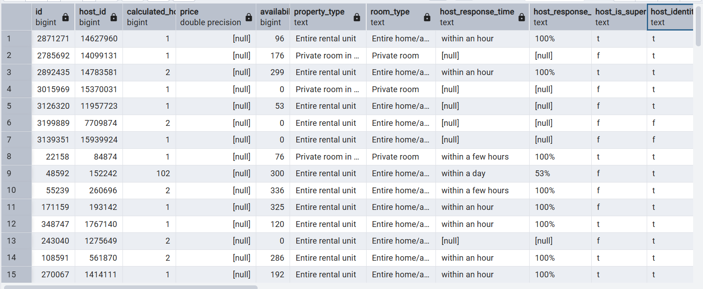
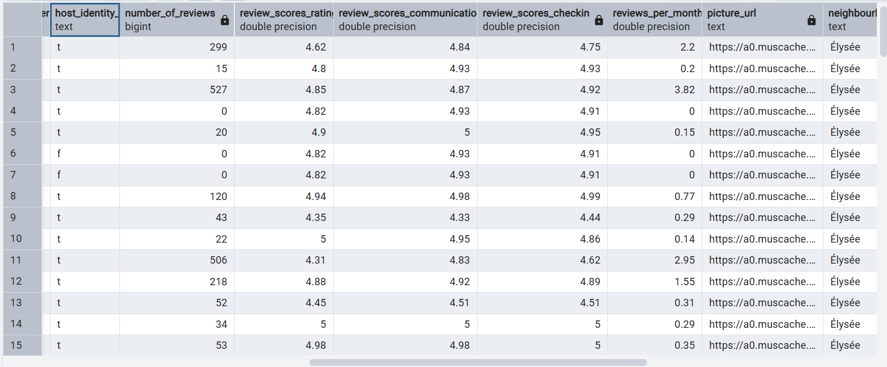
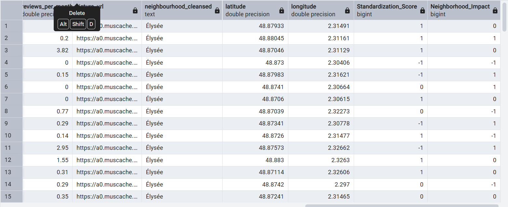

ImmoVision 360 — Analyse de la Gentrification du Quartier Élysée (Paris)
Contexte
Projet Data Science commandé par la Mairie de Paris pour analyser l'impact
des locations Airbnb sur la gentrification du quartier de l'Élysée.
Les données proviennent du portail Open Data Inside Airbnb.

Structure du Projet
ImmoVision360_DataLake/
├── data/
│   ├── raw/                        # Zone Bronze (données brutes)
│   │   ├── tabular/
│   │   │   ├── listings.csv
│   │   │   └── reviews.csv
│   │   ├── images/                 # [ID].jpg (ignoré par Git)
│   │   └── texts/                  # [ID].txt (ignoré par Git)
│   └── processed/                  # Zone Silver (données enrichies)
│       ├── filtered_elysee.csv
│       ├── transformed_elysee.csv
│       └── visualisations/         # Graphiques PNG
├── scripts/
│   ├── 01_ingestion_images.py
│   ├── 02_ingestion_textes.py
│   ├── 03_sanity_check.py
│   ├── 04_extract.py
│   ├── 05_transform.py
│   ├── 06_load.py
│   └── 07_eda_visualisation.py
├── .env.example
├── .gitignore
└── README.md

Prérequis

Python 3.10+
PostgreSQL 14+
Librairies Python :

bashpip install pandas requests Pillow google-genai python-dotenv sqlalchemy psycopg2-binary matplotlib seaborn

Variables d'environnement
Copiez .env.example en .env et remplissez vos valeurs :
GEMINI_API_KEY=votre_cle_gemini
DB_USER=postgres
DB_PASSWORD=votre_mot_de_passe
DB_HOST=localhost
DB_PORT=5432
DB_NAME=immovision_db

Ordre d'exécution
bash# PHASE 1 — Data Lake
python scripts/01_ingestion_images.py
python scripts/02_ingestion_textes.py
python scripts/03_sanity_check.py

# PHASE 2 — ETL
python scripts/04_extract.py
python scripts/05_transform.py
python scripts/06_load.py

# PHASE 3 — EDA
python scripts/07_eda_visualisation.py

Résultats
ÉtapeFichier produitLignesExtractfiltered_elysee.csv2625Transformtransformed_elysee.csv2625LoadTable PostgreSQL elysee_listings_silver2625EDA8 graphiques PNG—

Hypothèses testées
HypothèseDescriptionRésultatH1 — Standardisation visuelleLes logements sont-ils devenus des produits standardisés ?Analysée via Standardization_ScoreH2 — Déshumanisation socialeLe lien social se brise-t-il au profit de processus automatisés ?Analysée via Neighborhood_ImpactH3 — Concentration (Machine à Cash)Une poignée d'hôtes contrôle-t-elle le marché ?Analysée via calculated_host_listings_count

Data Lake — Zone Bronze
Architecture
data/raw/
├── tabular/
│   ├── listings.csv     # Annonces Airbnb (81 853 lignes, 70 colonnes)
│   └── reviews.csv      # Commentaires voyageurs
├── images/              # Photos des appartements [ID].jpg (320x320 px)
└── texts/               # Commentaires agrégés par annonce [ID].txt
Conventions de nommage
TypeFormatExempleImage<ID>.jpg785412.jpgTexte<ID>.txt785412.txtTabulairenom originallistings.csv
Principes appliqués

Schema-on-Read : Le Data Lake accepte tout sans contrainte de schéma
Idempotence : Les scripts vérifient si le fichier existe avant de le télécharger
Rate Limiting : Pause entre chaque requête pour respecter les serveurs

Extract — Sélection des colonnes (Script 04)
Sur les 70 colonnes disponibles, 20 ont été conservées :
ColonneHypothèseJustificationidToutesClé de jointurehost_idH3Identifier les multi-propriétairescalculated_host_listings_countH3Détecter la gestion industriellepriceH3Analyser la hausse des prixavailability_365H3Disponibilité = usage locatif intensifproperty_typeH3Type de bienroom_typeH3Logement entier = usage hôtelierhost_response_timeH2Agence = réponse ultra-rapidehost_response_rateH2Taux de réponse professionnelhost_is_superhostH2Indicateur de professionnalisationnumber_of_reviewsH2Volume d'activitéreview_scores_ratingH2Satisfaction globalereview_scores_communicationH2Qualité du lien humainreview_scores_checkinH2Accueil humain vs boîte à clésreviews_per_monthH2Fréquence d'occupationpicture_urlH1Lien vers la photoneighbourhood_cleansedToutesFiltrage géographiquelatitude / longitudeToutesCartographie

Transform — Nettoyage & Enrichissement IA (Script 05)
Gestion des valeurs manquantes
ColonneStratégieJustificationreview_scores_*MédianeNe pas fausser la distributionreviews_per_month0Logement neuf = 0 avishost_response_time"N/A"Absence d'information explicite
Nouvelles colonnes IA
ColonneValeurs possiblesDescriptionStandardization_ScoreAppartement industrialisé / Appartement personnel / AutreAnalyse visuelle par GeminiNeighborhood_ImpactHôtélisé / Voisinage naturel / NeutreAnalyse textuelle par Gemini
Note sur l'IA
Les appels à l'API Google Gemini ont été simulés par des valeurs aléatoires
en raison du dépassement du quota gratuit. En production, chaque image et
chaque fichier texte sont envoyés à gemini-2.0-flash pour classification.

Audit des données (Sanity Check)
MétriqueValeurAnnonces totales CSV81 853Annonces Élysée2 625Colonnes extraites20 / 70Lignes après transform2 625Lignes chargées en PostgreSQL2 625Graphiques EDA produits8

Analyse des pertes
Les images et textes manquants sont dus à :

Liens expirés par Airbnb (biens supprimés)
Blocage anti-bot des serveurs d'hébergement
Annonces sans commentaires (logements récents)

Licence des données
Inside Airbnb — Creative Commons CC BY 4.0
Usage académique uniquement — projet non commercial.

## Preuve PostgreSQL — Data Warehouse
### Colonnes : id, host_id, price, availability

### Colonnes : notes, reviews, neighbourhood

### Colonnes IA : Standardization_Score, Neighborhood_Impact

